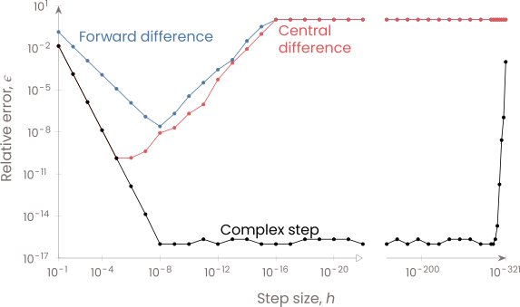

.. complexify documentation master file, created by sphinx-quickstart.
   You can adapt this file completely to your liking, but it should at least
   contain the root `toctree` directive.

.. _complex-step: https://www.researchgate.net/publication/222112601_The_Complex-Step_Derivative_Approximation

.. _complexify:

Complexify
==========

`Complexify` serves two purposes:

   #. Provides a Fortran library and scripts to covert Fortran code to complex-step compatible code.
   #. Provides complex safe numpy functions that can be imported into your python code.

Source code is available on `GitHub <https://github.com/mdolab/complexify>`__

Background
----------
The complex-step is a method for estimating derivatives.

The complex-step derivative approximation is a very convenient way of estimating derivatives numerically. It is a simple and accurate means of finding derivatives of a quantity calculated by an existing algorithm.

If :math:`f` is the result of any (real-valued) numerical algorithm, and :math:`x` is one of the input variables, then the derivative :math:`\partial f / \partial x` is simply

.. math::
   \frac{\partial f}{\partial x} \approx \frac{\Im\left[ f(x+ih) \right]}{h}

where :math:`\Im` is the imaginary part, :math:`i` is the imaginary unit, and :math:`h` is a small step size. How small? h = 1.0e-200 works very well in nearly all cases, and results in derivatives no less accurate than the original algorithm.
In some instances, different architectures may give noticeable errors at smaller step sizes so if you are unsure and it is possible, check the computed derivatives.

The complex-step derivative approximation is a second order accurate formula analogous to finite-differencing, but it does not have a subtraction operation and therefore it is not subject to subtractive cancellation, which we demonstrate in the plot below.
Further details are available in the materials referenced below and in the `complex-step`_ paper.

.. toctree::
   :maxdepth: 2

   installation
   examples
   citation
   API